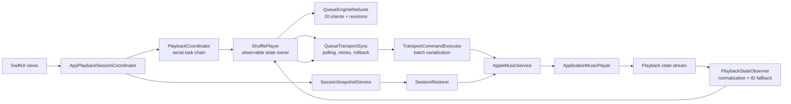
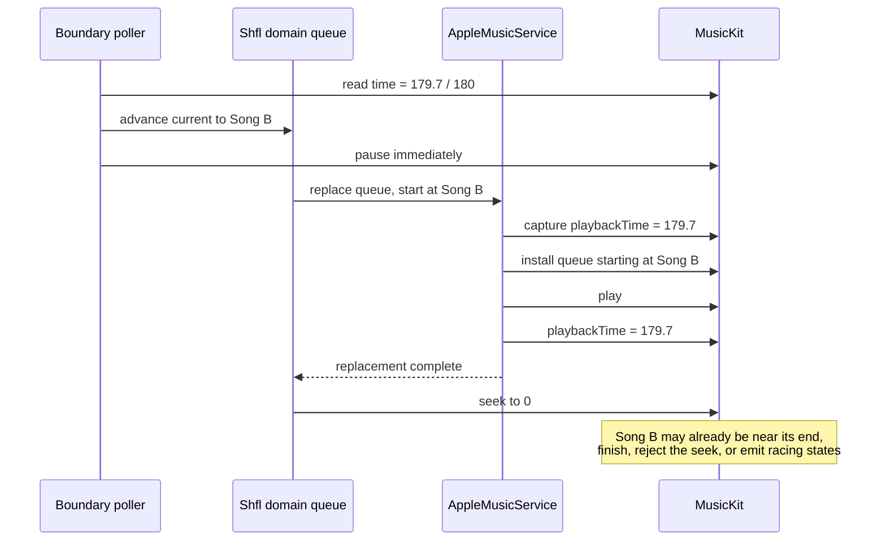
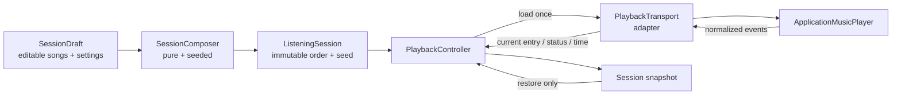
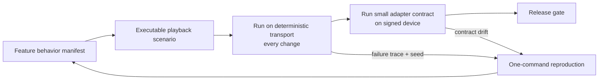

# Deletion-First Playback Stability

**Status:** Implemented; pending signed-device contract test
**Date:** 2026-07-19
**Decision owner:** Shfl
**Scope:** Shuffle composition, playback, session restoration, playback persistence, and their regression tests

## Executive decision

Shfl will stop trying to rewrite the MusicKit queue during continuous playback.

A **listening session** will be composed once, loaded once, and then treated as immutable. MusicKit will be the sole authority for the current entry, playback time, and natural advancement until the user explicitly starts a fresh shuffle, restores a saved session, or clears playback. Song-pool edits and shuffle-setting changes made during playback will update a **session draft** for the next fresh shuffle; they will not mutate the active transport queue.

This is a product simplification as much as a code simplification. It intentionally gives up seamless live queue rewriting. In return, it removes the timing-sensitive choreography responsible for the current regressions and makes normal playback testable without a live Apple Music account.

The target is not to add a better state machine. The target is to delete the state machine.

## Implementation record

The deletion-first architecture was implemented on 2026-07-19.

- `SessionDraft`, immutable `ListeningSession`, seeded `SessionComposer`, and a deterministic Fisher–Yates implementation now own shuffle composition.
- `PlaybackTransport` exposes one atomic `load` operation plus ordinary playback controls and normalized `PlaybackEvent` values.
- The active session does not mutate. Song edits and algorithm changes affect the next shuffle; the settings UI offers an explicit **Start New Shuffle Now** action.
- Final-session exhaustion emits an explicit adapter event and starts exactly one fresh session from the latest draft.
- `QueueEngine`, `QueueTransportSync`, `TransportCommandExecutor`, `PlaybackStateObserver`, `SessionRestorer`, `PlaybackCoordinator`, and `QueueState` were deleted.
- Restore performs one exact, paused load with the saved song, position, algorithm, and seed.
- The simulator test transport uses virtual time and never wraps at exhaustion.
- The deterministic suite passes 139 tests, including five-song continuity without a reload and transient-empty protection.
- The implementation change is approximately 6,000 lines net smaller across production and tests.

The remaining release gate is the small signed-device MusicKit contract suite described below. The simulator suite deliberately proves Shfl's behavior without claiming to prove Apple's runtime behavior.

## Why the answer kept becoming “more code”

The codebase encoded an increasingly difficult promise:

> A user can change the song pool or algorithm during a track, Shfl can immediately compute a different future order, and the MusicKit queue can be replaced at the exact track boundary without an audible interruption, losing position, duplicating a song, accepting stale events, or disagreeing with Shfl's domain queue.

MusicKit already owns a queue and advances through it. Shfl built a second queue authority around it, then added synchronization machinery to keep both authorities aligned. Each production bug exposed another timing case in that synchronization problem, so each fix added another condition, revision, retry, rollback, observer rule, or diagnostic event.

This is why eight months of bug fixes did not converge. The architecture made the difficult path the normal path.

## Evidence from the current codebase

### Size and shape

The playback orchestration currently contains approximately:

| Measure | Current value |
|---|---:|
| Production lines across the main playback orchestration modules | 2,656 |
| Focused test lines for the same area | 3,309 |
| `QueueIntent` cases | 20 |
| `TransportCommand` cases | 7 |
| Queue-operation journal event kinds | 51 |
| Methods in `ShufflePlayer` and `QueueTransportSync` | 68 |
| Explicit `Task` creation sites in the orchestration path | 9 |
| Commits touching the main playback path since 2025-01-01 | 80 |

The production count includes:

- `Shfl/Domain/ShufflePlayer.swift` — 635 lines
- `Shfl/Domain/ShufflePlayerTypes.swift` — 151 lines
- `Shfl/Domain/QueueEngine.swift` — 446 lines
- `Shfl/Domain/QueueTransportSync.swift` — 788 lines
- `Shfl/Domain/TransportCommandExecutor.swift` — 56 lines
- `Shfl/Domain/PlaybackStateObserver.swift` — 184 lines
- `Shfl/Domain/SessionRestorer.swift` — 83 lines
- `Shfl/Domain/PlaybackCoordinator.swift` — 127 lines
- `Shfl/ViewModels/AppPlaybackSessionCoordinator.swift` — 186 lines

Line count is not a quality metric by itself. Here it is useful because the majority of those lines exist to coordinate two competing queue authorities rather than to express user-facing shuffle behavior.

On a fixed, broader set of core playback files, production code grew from 1,671 lines at commit `4c60b19` to 3,754 at `HEAD` and 3,824 in the audited working tree—approximately 129% growth. Thirty-three commits touched `ShufflePlayer`, `QueueEngine`, or `QueueTransportSync` between February 7 and February 23 alone. The sequence of commit subjects tells the architectural story: serialize operations, repair drift, add diagnostics, add recovery, add revisions, centralize rollback, add retries, defer mutations, add boundary swapping, then fix swaps during swaps.

Two notable extractions increased total code:

- `f3804d5 Decompose ShufflePlayer`: +502 / −332;
- `ad78825 Deepen queue transport sync`: +1,274 / −888.

The latter produced a physically separate module, but `QueueTransportSync` still accepts ten closures back into `ShufflePlayer`. The extraction improved file organization more than ownership or locality.

### Current call path



The apparent direction is UI → domain → transport. At runtime it is a feedback loop:

1. A user intent mutates Shfl's queue state.
2. Shfl emits one or more revision-tagged transport commands.
3. MusicKit emits intermediate and final playback states.
4. `PlaybackStateObserver` normalizes or discards those states.
5. The reducer mutates Shfl's current index and played history.
6. `QueueTransportSync` checks cross-system invariants and may recover, retry, roll back, or load the queue again.

This loop has low locality: understanding a song transition requires simultaneous knowledge of at least six modules and MusicKit's asynchronous behavior.

## Failure anatomy

### The “second song starts midway or does not play” regression

The committed implementation at the start of this audit rebuilt the entire MusicKit queue at a song boundary:

1. `QueueTransportSync` polled playback every 100 ms.
2. When a track had at most 0.5 seconds remaining, it advanced Shfl's domain current song.
3. It synchronously paused MusicKit.
4. It asynchronously asked the reducer for a deferred queue synchronization.
5. `AppleMusicService.replaceQueue` captured the old track's playback time.
6. It installed a queue starting at the new song.
7. It started the new song and applied the old track's near-end time.
8. The caller issued a separate `seek(to: 0)` after replacement.



The working-tree hotfix makes start position explicit and atomic. That is the correct immediate repair, but it does not make the surrounding architecture a good long-term bet. The preemptive boundary swap still performs unnecessary queue mutation during the most timing-sensitive part of playback.

### The “shuffle looks like insertion order” symptom

The pure shuffle code does call Swift's randomization functions. The visible insertion-order symptom is therefore not enough to prove that the shuffle algorithm itself returned insertion order.

There are multiple later places where order can be lost or replaced:

- Session restoration intentionally reinstates persisted order.
- The Apple Music adapter resolves IDs with `MusicLibraryRequest`, then reconstructs the requested order.
- The old adapter could silently accept partial resolution and install fewer items than Shfl expected.
- Shfl and MusicKit maintained separate current-entry concepts.
- A queue rebuild could replace the active MusicKit order with a newly reconciled domain order.

The system did not record one trace containing the composed order, fully resolved transport order, and observed playback order. As a result, diagnostics could report internal invariant health while the user heard the wrong sequence.

There is also no deterministic seed today. `QueueShuffler` uses global `shuffled()`, `randomElement()`, and dictionary-key iteration. Even a correct run cannot be reproduced exactly from a failure report.

Two algorithms have an additional small-library trap. Weighted recency and weighted play count choose `tierSize = max(1, songs.count / 10)`. Below ten songs, every tier contains one entry, so the “shuffle within tiers” step cannot change the sorted order. Equal or absent metadata can therefore preserve library/addition order. Queue reconciliation also appends missing entries in song-pool order. The reported shuffle symptom may be a real algorithm outcome, a restoration outcome, or a transport-materialization outcome; today's trace cannot distinguish them.

### Partial MusicKit resolution

The old adapter used `compactMap` when turning requested song IDs into MusicKit items. Missing songs were logged but the command could still succeed. The domain then marked the transport synchronized even though the installed queue was incomplete.

The working-tree hotfix now rejects partial resolution. That behavior must remain in the new transport adapter: loading a listening session is atomic from Shfl's perspective—every entry resolves, or no new session is accepted.

## Why the tests stayed green

The test suite mainly verifies the internal choreography it was given, not the audible product outcome.

### The fake did not model the production failure

The committed `MockMusicService.replaceQueue` copied an array and changed an index. It did not:

- carry the old track's playback time onto the newly selected entry;
- model queue preparation latency;
- auto-advance when a duration is reached;
- emit MusicKit's intermediate stopped, empty, loading, or current-entry states;
- resolve library IDs or drop missing items;
- make a post-load seek race with playback.

The mock therefore defined a friendlier contract than the real adapter. Tests could prove that Shfl called `replaceQueue` and later called `seek`, while never exercising the behavior created by that ordering.

### Assertions targeted implementation state

Many boundary tests assert outcomes such as:

- `queueNeedsBuild` eventually becomes `false`;
- a replacement call count is one;
- the domain queue contains all expected IDs;
- a retry is scheduled or exhausted;
- an invariant journal entry exists.

Those assertions can all pass while the second song begins at 179 seconds. The missing product assertion was:

> After the first song completes naturally, the planned second song is playing and its position is approximately zero.

### The most valuable broad checks were removed

The repository history shows:

- CI workflow removal in commit `9e05c95`;
- UI test removal in commit `f63aacd`;
- removal of `ShflTests/Integration/AppFlowTests.swift` in commit `a78748b`.

Removing slow or tautological tests can be healthy. In this case there was no replacement release gate for the user-visible playback path. A large unit suite remained, but no deterministic scenario exercised composition → queue load → natural advancement → persisted observation.

There is also a production heuristic outside the playback modules: `MainView` treats a transition from active playback to `.empty` or `.stopped` as natural exhaustion and starts a library reshuffle. MusicKit's `.empty` currently also represents startup gaps, discarded stale emissions, and failed queue transitions. A transient adapter event can therefore launch a new session from a view. The new architecture replaces this inference with an explicit adapter-owned `sessionEnded` event.

### Randomness was not reproducible

Tests generally validate membership and broad constraints, which is appropriate for algorithm properties, but failures cannot be replayed with an exact seed and expected order. A report that “shuffle played in library order” cannot currently be reconstructed on a developer machine.

## Architectural forces

The new design must balance these facts:

1. MusicKit is an external asynchronous system with authorization, subscription, library-resolution, and device behavior that a simulator cannot completely reproduce.
2. Shfl's differentiating behavior is session composition, not audio transport.
3. The common case is continuous playback through an already composed shuffled order.
4. Live queue editing is useful but not valuable enough to make every natural track transition a queue-replacement transaction.
5. Session restore needs an exact entry and position, but it occurs at a controlled lifecycle point before continuous playback resumes.
6. Fast feedback requires almost all product behavior to run without Apple Music.
7. A small real-device contract suite is still required to keep the deterministic adapter honest.

## Design principles

This design applies the following teachings as constraints rather than decoration.

### Martin Fowler: pay the cost of carry only for capabilities we use

Fowler's treatment of [YAGNI](https://martinfowler.com/bliki/Yagni.html) emphasizes that presumptive flexibility has an ongoing cost of carry and that an abstraction which makes current requirements harder to understand should be presumed guilty. Seamless active queue rewriting is exactly such a capability: it forces complexity into every normal song boundary even though a stable immutable session satisfies the core product.

His [Design Stamina Hypothesis](https://martinfowler.com/bliki/DesignStaminaHypothesis.html) also explains the eight-month pattern: neglecting internal design can appear faster briefly, then lower the rate at which working behavior can be delivered. The proposed deletion is an investment in sustained delivery, not architecture for its own sake.

### Sandi Metz: back out of the wrong abstraction

In [The Wrong Abstraction](https://sandimetz.com/blog/2016/1/20/the-wrong-abstraction), Metz describes the pattern where an initially shared abstraction accumulates parameters and conditional paths for requirements that are only almost alike. Her remedy is to inline, delete irrelevant branches, and let a better abstraction emerge.

`QueueEngineReducer` plus `QueueTransportSync` exhibit that pattern. Queue preparation, active add, active remove, pause/resume, algorithm change, restore, stale-command recovery, invariant recovery, and boundary transition all travel through a shared revisioned command abstraction, but require different rollback and timing semantics. We will not preserve that investment merely because it is substantial.

### John Ousterhout: prefer deep modules and pull complexity downward

Ousterhout's Stanford notes on [Managing Complexity](https://web.stanford.edu/~ouster/cgi-bin/cs190-spring15/lecture.php?topic=complexity) define a good module as one that provides substantial functionality behind a simple interface and identifies deep call stacks and information leakage as warning signs.

The current modules are individually named and separated, but their interfaces leak the same concepts—revision, queue order, current song, playback state, position, and recovery—through the entire stack. The new session composer and transport adapter will have small interfaces with deep implementations.

### David Parnas: hide the design decision most likely to change

Parnas's paper [On the Criteria To Be Used in Decomposing Systems into Modules](https://citeseerx.ist.psu.edu/document?doi=5d752e29e29b42cc509417699a98d9dca8212c83&repid=rep1&type=pdf) argues for decomposing around hidden design decisions rather than processing steps.

MusicKit's ID resolution, queue readiness, event ordering, and position semantics are the volatile decisions. They belong inside one transport adapter. Shfl's domain must not know whether MusicKit emits a transient empty state before a current entry becomes available.

### Rich Hickey: do not complect intent, order, time, and transport

In [Simple Made Easy](https://www.infoq.com/presentations/Simple-Made-Easy/), Hickey distinguishes simplicity from familiarity and focuses on avoiding interleaved concerns. The current loop braids together:

- editable library intent;
- randomized session order;
- current playback position;
- transport queue mutation;
- asynchronous event normalization;
- retry and rollback policy.

The new design separates these into immutable data and one-way effects.

## Proposed architecture

### One-way model



There is no feedback edge that rebuilds the active queue in response to normal playback events.

### Module 1: `SessionDraft`

Owns:

- the selected song pool;
- capacity rules;
- the algorithm selected for the next fresh shuffle.

Behavior:

- Adding or removing songs always updates the draft immediately.
- If no listening session is active, the UI can start a fresh shuffle from the new draft.
- If a session is active, the UI clearly labels the effect as “Next shuffle.”
- Clearing all songs is an explicit destructive action that stops playback and clears both the draft and active session.

`SessionDraft` contains no current index, played history, transport status, revision, or “needs build” flag.

### Module 2: `SessionComposer`

This is a pure, deep domain module:

```swift
struct SessionComposer {
    func compose(
        draft: SessionDraft,
        seed: UInt64
    ) throws -> ListeningSession
}
```

It returns:

```swift
struct ListeningSession: Codable, Equatable, Sendable {
    let id: UUID
    let songOrder: [Song]
    let algorithm: ShuffleAlgorithm
    let seed: UInt64
    let createdAt: Date
}
```

Requirements:

- Same draft + algorithm + seed must produce the same exact order.
- No global randomness.
- Stable input ordering before randomization.
- Stable artist grouping and tie-breaking; dictionary iteration must not influence output.
- Every song ID appears exactly once unless a future product requirement explicitly permits repeats.
- The seed is persisted with the listening session and included in diagnostics.

The implementation can reuse the current algorithms, but every random choice receives an injected seeded generator.

### Module 3: `PlaybackController`

One `@MainActor` owner replaces the current reducer/synchronizer/coordinator chain.

It owns:

- the current `SessionDraft`;
- the active `ListeningSession?`;
- the latest normalized transport snapshot;
- an `isLoadingSession` guard for explicit fresh-load and restore operations;
- persistence triggers.

It does not own:

- a shadow transport current index;
- a transport revision;
- a queue-rebuild flag;
- retry drains;
- rollback policies;
- boundary timers;
- command batches.

Illustrative interface:

```swift
@MainActor
final class PlaybackController {
    func updateDraft(_ mutation: DraftMutation)
    func startFreshShuffle(seed: UInt64? = nil) async throws
    func restore(_ snapshot: ListeningSessionSnapshot) async throws
    func play() async throws
    func pause()
    func next() async throws
    func previous() async throws
    func clear() async

    var draft: SessionDraft { get }
    var activeSession: ListeningSession? { get }
    var playback: TransportSnapshot { get }
}
```

This is intentionally not a general intent/reducer framework. It is the small set of operations the product performs today.

### Module 4: transport interface and implementations

The transport interface exposes one atomic load operation:

```swift
struct TransportLoad: Sendable {
    let session: ListeningSession
    let startSongID: String
    let startPosition: TimeInterval
    let autoplay: Bool
}

protocol PlaybackTransport: Sendable {
    func load(_ request: TransportLoad) async throws
    func play() async throws
    func pause()
    func next() async throws
    func previous() async throws
    func clear()
    func snapshot() -> TransportSnapshot
    var events: AsyncStream<TransportEvent> { get }
}
```

There is no public sequence of `setQueue`, select entry, prepare, seek, and play. The adapter accepts all load semantics together and either completes them or throws.

#### `AppleMusicPlaybackTransport`

Owns and hides:

- `MusicLibraryRequest` and complete ID resolution;
- requested-song-ID to MusicKit-entry mapping;
- queue construction and selected start item;
- `prepareToPlay`;
- playback-time application;
- autoplay/pause policy;
- MusicKit observation and transient event normalization;
- verification that the installed current entry matches the request.

The adapter emits domain song IDs. `PlaybackController` never falls back to title/artist/album matching and never interprets transient MusicKit states.

Load postconditions:

1. Every requested ID resolved.
2. Installed entry count equals session entry count.
3. Installed current domain song ID equals `startSongID`.
4. Observed position is within tolerance of `startPosition`.
5. Final playback status matches `autoplay`.

If a postcondition cannot be established within a bounded adapter-owned timeout, `load` throws and the prior active session remains the app's last known session. No reducer rollback is needed because domain state is committed only after load succeeds.

#### `DeterministicPlaybackTransport`

This is a working implementation, not a call-count mock. It owns:

- a virtual clock;
- deterministic queue-load delay;
- exact durations;
- natural auto-advance;
- play, pause, next, previous, and clear semantics;
- configurable resolution failures;
- configurable event sequences for known MusicKit edge cases;
- an append-only action/event trace.

Tests advance virtual time explicitly. No wall-clock sleeps are required.

### State ownership

| State | Sole owner | Consumers |
|---|---|---|
| Selected songs and next algorithm | `SessionDraft` | UI, composer, persistence |
| Exact active order and seed | `ListeningSession` | controller, persistence, diagnostics |
| MusicKit queue representation and entry mapping | Apple Music transport implementation | transport implementation only |
| Current entry, status, duration, and time | transport | controller projection, UI, scrobbling |
| Played history | derived from ordered transport entry-change events | persistence, scrobbling |
| Restored start entry and position | persisted session snapshot until one atomic load | controller, transport |

The phrase “single source of truth” is meaningful only when scoped. Shfl is authoritative for intended session order. MusicKit is authoritative for live playback. The adapter is authoritative for mapping between them.

## Product behavior under the new model

| User action | No active session | Active session |
|---|---|---|
| Add song | Update draft | Update draft; badge “Next shuffle” |
| Remove upcoming song | Update draft | Update draft only; current session unchanged |
| Remove current song from library | Update draft | Song may finish in current session; absent next shuffle |
| Change shuffle algorithm | Update draft setting | Update next-shuffle setting; current order unchanged |
| Tap Shuffle / New Shuffle | Compose, load at first song, play | Explicitly replace active session, start new first song at zero |
| Play / pause | Delegate to transport | Delegate to transport |
| Next / previous | Delegate to transport | Delegate to transport |
| Natural song completion | Transport advances | Transport advances; after the final entry, one explicit end event composes the next draft |
| Restore app session | Atomic paused load at saved entry/time | Performed only during startup before normal controls enable |
| Clear all | Clear draft and transport | Stop, clear draft, clear active session and snapshot |

This behavior should be documented in the UI. “Next shuffle” is not an implementation detail; it is the honest product contract that buys stability.

## Hard invariants

1. An active listening session's order never mutates.
2. Normal track-advancement events never issue a queue load.
3. Natural song completion is handled by the transport, not by Shfl.
4. A queue load occurs only for a fresh shuffle, session restore, explicit replacement, or confirmed final-session exhaustion.
5. A load request includes start entry, start position, and autoplay as one value.
6. A load succeeds only if every song resolves and all postconditions hold.
7. The session becomes active in Shfl only after transport load succeeds.
8. Every fresh shuffle records its seed.
9. Same input plus seed produces the same exact order on every supported OS.
10. The domain never interprets MusicKit queue entry identifiers or transient state ordering.

These are architectural tests. Any change that violates one must be treated as a design change, not patched as an edge case.

## Deterministic regression loop

### The loop



Each user-visible playback feature gets:

1. a one-sentence behavior statement;
2. an executable scenario using product-level actions;
3. exact observable outcomes;
4. a deterministic seed and virtual timeline;
5. classification as deterministic-only or also an Apple Music contract.

### Core playback scenarios

The following scenarios are release-blocking:

| Scenario | Required assertions |
|---|---|
| Fresh shuffle | Loaded order equals composed order; first song begins at 0; status is playing |
| Natural advancement | After first duration elapses, second planned song is current, playing, and near 0 |
| Five-song continuity | First five songs follow planned order; each begins near 0; no load after initial load |
| Pause/resume | Same song and position are preserved; no queue load |
| Manual next | Next planned entry begins near 0; no queue rebuild |
| Manual previous/restart | Product threshold semantics hold |
| Edit during playback | Draft changes; active order and transport load count do not |
| Algorithm change during playback | Draft setting changes; active order does not |
| Explicit fresh shuffle | Exactly one new load; new session ID and seed; first entry at 0 |
| Restore | Exact saved order, entry, paused status, and saved position |
| Partial resolution | Load fails atomically; no session marked active |
| Queue exhaustion | One explicit end event creates one fresh session from the latest draft |
| Clear | Playback stops, queue clears, and persistence clears |

### Example scenario

```swift
func naturalAdvancementStartsEverySongAtZero() async throws {
    let transport = DeterministicPlaybackTransport(
        durations: ["a": 180, "b": 210, "c": 195]
    )
    let controller = makeController(transport: transport)

    try await controller.startFreshShuffle(seed: 42)
    let expected = try XCTUnwrap(controller.activeSession?.songOrder)

    transport.clock.advance(by: 180)

    XCTAssertEqual(controller.playback.currentSongID, expected[1].id)
    XCTAssertEqual(controller.playback.position, 0, accuracy: 0.05)
    XCTAssertEqual(controller.playback.status, .playing)
    XCTAssertEqual(transport.trace.loads.count, 1)
}
```

The final assertion is crucial: continuous playback must not secretly rebuild the queue.

### Real MusicKit contract suite

We do not need live Apple Music for every regression test. We do need it to validate the adapter's assumptions.

Fowler's guidance on [eradicating nondeterminism](https://martinfowler.com/articles/nonDeterminism.html) recommends deterministic doubles for remote systems and separate contract tests to keep the doubles honest. His [Contract Test](https://martinfowler.com/bliki/ContractTest.html) description makes the same separation explicit.

Run these checks on a signed physical device with a controlled Apple Music test library:

1. Resolve and load three known songs in a requested non-library order.
2. Verify the installed count and current domain song ID.
3. Verify a fresh load starts the first song near zero.
4. Let two short tracks advance naturally and verify order and start positions.
5. Restore the second song paused at a known position.
6. Request one missing ID and verify atomic failure.
7. Capture the actual MusicKit event sequence for load, play, pause, next, and natural completion.

This suite is small by design. It validates the transport implementation, not the entire app.

Execution policy:

- deterministic scenarios: every local test run and every CI change;
- Apple Music contract: scheduled daily on a controlled device if infrastructure exists, otherwise before every beta/release;
- release gate: contract evidence must be green and no older than seven days;
- on contract drift: update the adapter and deterministic transport together.

Apple's MusicKit documentation describes `ApplicationMusicPlayer` as the app-owned player and exposes a queue with a selected starting item, observable current entry, playback time, and natural transport controls. See [MusicPlayer.Queue](https://developer.apple.com/documentation/musickit/musicplayer/queue) and Apple's [Integrate MusicKit into your app](https://developer.apple.com/videos/play/wwdc2026/254/) session. Those capabilities support loading one complete queue and letting the player advance it; Shfl does not need to simulate advancement.

## Test portfolio changes

### Keep

- shuffle algorithm property tests;
- persistence serialization and stale-snapshot tests;
- scrobbling tests;
- transport adapter contract scenarios;
- a small number of UI tests for “Next shuffle,” explicit fresh shuffle, restore, and error display.

### Rewrite

- queue membership tests as `SessionComposer` properties;
- playback flows as scenario tests against `DeterministicPlaybackTransport`;
- restore tests through the atomic `TransportLoad` contract;
- identifier-resolution tests inside the Apple Music adapter.

### Delete

- revision-gating tests;
- boundary swap tests;
- active-add retry tests;
- rollback-policy tests;
- tests asserting journal event kinds;
- call-count tests that merely repeat implementation steps;
- tests for transient state normalization outside the adapter;
- reducer cases that exist only for active queue rebuilding.

The goal is not fewer assertions. It is fewer assertions about machinery the user cannot observe and more assertions about what they hear and see.

Fowler's [Self-Testing Code](https://martinfowler.com/bliki/SelfTestingCode.html) defines the standard as confidence that one command will expose substantial defects, not a large green count. The current 282 passing tests are useful evidence about many modules, but they did not form a bug detector for the core playback journey.

## Migration plan

The migration is a sequence of vertical deletions. Temporary scaffolding is allowed only inside a branch and must not survive a phase.

### Phase 0 — Freeze the behavioral contract

Before structural changes:

- keep the immediate atomic-position regression test;
- add the feature behavior manifest;
- add deterministic seeds to the existing shuffler seam;
- write three black-box scenarios: fresh shuffle, natural advancement, restore;
- capture one real-device MusicKit event trace for those scenarios.

Exit gate:

- the old code fails the natural-advancement scenario when the old adapter semantics are enabled;
- the current hotfix passes it in the deterministic model;
- expected product behavior is agreed in plain language.

### Phase 1 — Stop mutating the active session

Change product behavior first:

- edits update the session draft;
- algorithm changes update the session draft;
- UI shows “Applies to next shuffle”;
- remove active add/remove/reshuffle transport commands;
- remove `queueNeedsBuild` from the active playback path.

Delete immediately:

- active-add retry state and delays;
- `resyncActiveAddTransport`;
- active remove queue transition;
- deferred algorithm synchronization.

Exit gate:

- no edit-during-playback scenario emits a transport load;
- production playback LOC is lower than at phase start.

### Phase 2 — Delete boundary synchronization

- load the full composed order once;
- let MusicKit naturally advance;
- delete the 100 ms poller and 0.5-second lead-time rule;
- delete preemptive and reactive boundary swap states;
- delete pause-at-boundary and follow-up seek behavior;
- delete boundary-specific diagnostics and tests.

Exit gate:

- five-song deterministic continuity scenario passes;
- signed-device two-song natural transition passes;
- only one load appears in each trace.

### Phase 3 — Collapse orchestration

- introduce `SessionDraft`, `ListeningSession`, and seeded `SessionComposer`;
- replace `ShufflePlayer`, `QueueEngineReducer`, `QueueTransportSync`, `TransportCommandExecutor`, and `PlaybackCoordinator` with `PlaybackController`;
- make the transport adapter emit normalized domain events;
- remove metadata fallback and state normalization from the domain.

Exit gate:

- each user action can be understood within `PlaybackController` plus at most one deep module;
- no revision, rollback policy, invariant recovery intent, or generic transport command remains.

### Phase 4 — Simplify restore and persistence

- persist the immutable listening session, seed, current domain song ID, observed position, and saved time;
- restore through one paused `TransportLoad`;
- commit restored domain state only after the load postconditions pass;
- delete the multi-step `SessionRestorer`.

Exit gate:

- exact deterministic restore passes;
- real-device restore contract passes;
- failed restore falls back to an explicit fresh shuffle without partial domain state.

### Phase 5 — Restore the release safety net

- reinstate CI for deterministic tests;
- add a small UI scenario suite;
- configure or document the signed-device contract lane;
- make the feature behavior manifest part of release review;
- report deterministic seed and transport trace on every scenario failure.

Exit gate:

- one command runs the complete deterministic regression suite;
- a beta cannot be marked releasable without recent contract evidence;
- the core playback scenario list is entirely green.

## File disposition

| Current file | Decision | Replacement / reason |
|---|---|---|
| `QueueTransportSync.swift` | Delete | Active queue synchronization no longer exists |
| `TransportCommandExecutor.swift` | Delete | No revisioned command batches |
| `QueueEngine.swift` | Delete | Draft mutation and session composition are separate, direct modules |
| `ShufflePlayerTypes.swift` | Mostly delete | Remove operation journal, invariant, retry, and boundary types |
| `ShufflePlayer.swift` | Replace | One smaller `PlaybackController` |
| `PlaybackCoordinator.swift` | Delete | No second generic serialization layer |
| `PlaybackStateObserver.swift` | Delete or reduce to adapter-private code | MusicKit normalization belongs in the transport implementation |
| `SessionRestorer.swift` | Delete | Restore is one atomic load |
| `QueueState.swift` | Replace | Split editable `SessionDraft` from immutable `ListeningSession` |
| `QueueShuffler.swift` | Retain and change | Make every algorithm seeded and deterministic |
| `AppleMusicService.swift` | Extract playback implementation | One deep Apple Music transport adapter; library interfaces remain separate |
| `AppPlaybackSessionCoordinator.swift` | Reduce | Lifecycle, persistence, and scrobbling only |
| `SessionSnapshotService.swift` | Simplify | Persist/restore session values, not shadow-queue repair state |
| `MainView.swift` exhaustion hook | Delete | Session exhaustion becomes an explicit transport event, not an `.empty` heuristic |
| `DebugQueueView.swift` parity UI | Delete | Retain only compact session seed/order/load/event diagnostics |

## Deletion budget and architecture gates

The current architecture has repeatedly turned fixes into net growth. The migration will use explicit negative budgets:

- reduce main playback orchestration from 2,656 production lines to **1,300 or fewer**;
- delete at least **1,300 production lines** net by completion;
- reduce active playback owners from the current chain to **one controller and one transport adapter**;
- reduce transport queue-load call sites to **two semantic operations**: fresh start and restore;
- permit **zero** timer/poller logic for natural track advancement;
- permit **zero** generic rollback policies and queue revisions;
- permit **zero** active-session mutation paths;
- permit **zero** view-level inference of session exhaustion from generic playback state;
- require each migration phase to be net-negative in production playback code before merge.

These numbers are guardrails, not a request to compress readable code. If the design cannot meet them, the design must explain which user-visible requirement genuinely needs the extra machinery.

## Rollout and rollback

### Development rollout

1. Implement on a dedicated branch.
2. Keep the old architecture available only through git history, not a permanent runtime flag.
3. Use deterministic scenarios as the migration harness.
4. Run signed-device contracts after every change to the Apple Music transport implementation.
5. Dogfood a beta with transport traces enabled but bounded.

A long-lived dual architecture would recreate the synchronization problem and double the test burden. Rollback is a build rollback to the last known version, not an in-app architecture toggle.

### Minimal diagnostics

On fresh load or restore, record one bounded diagnostic:

- app/build version;
- session ID;
- algorithm and seed;
- requested domain order hash;
- resolved domain order hash;
- requested start song and position;
- observed start song and position;
- load duration and outcome.

On each current-entry change, record:

- session ID;
- previous and current domain song IDs;
- observed start position;
- reason if known: natural, next, previous, restore.

Do not rebuild a 51-event internal operation journal. Diagnostics should describe the product contract and make failures reproducible.

## Risks and accepted trade-offs

### Active edits no longer change the current queue

This is the primary trade-off. The UI must communicate it clearly. If user evidence later proves live insertion essential, MusicKit supports queue insertion operations; that capability can be designed as a separate, narrow feature with its own contract. We should not prebuild it now.

### A deterministic transport can drift from MusicKit

It will. That is why the small contract suite exists. The deterministic implementation owns product semantics; the contract suite detects adapter drift without making every test slow or account-dependent.

### Real-device automation may be operationally awkward

Start with a documented manual pre-release run if necessary. The suite is intentionally small enough to execute in minutes. Automating a controlled device is valuable, but lack of that infrastructure must not block deterministic CI.

### MusicKit may emit undocumented transient states

Those states remain inside the adapter. The contract trace captures them and adapter tests replay them. They do not create new domain intents.

### Immutable sessions reduce feature flexibility

They also make “what will play next?” a stable promise. New capabilities must justify breaking that promise explicitly.

## Acceptance criteria

The migration is complete when all of the following are true:

- [ ] Fresh shuffle order is reproducible from persisted input and seed.
- [ ] First five naturally advancing songs follow the exact composed order.
- [ ] Every naturally advanced song begins within 0.25 seconds of zero in the real-device contract.
- [ ] Normal playback performs exactly one transport load.
- [ ] Edits and algorithm changes during playback perform zero transport loads.
- [ ] Pause/resume preserves song and position without a queue load.
- [ ] Restore reinstates exact order, entry, paused status, and position.
- [ ] Partial MusicKit resolution fails atomically.
- [ ] Deterministic scenarios run with one command in CI.
- [ ] Apple Music contract evidence is green and no older than seven days for a release.
- [ ] Main playback orchestration is 1,300 production lines or fewer.
- [ ] `QueueTransportSync`, `TransportCommandExecutor`, and boundary polling are gone.
- [ ] No production code refers to queue revisions, rollback policies, deferred transport synchronization, or boundary swaps.
- [ ] The feature behavior manifest has no unimplemented or untested core playback behavior.

## Recommendation

Proceed with the deletion-first architecture.

Do not invest further in making boundary queue replacement more reliable. Keep the atomic start-position hotfix as immediate protection, then remove the behavior that requires it during natural advancement. The fastest route to stability is to narrow the product contract, give MusicKit sole control of continuous playback, make shuffle composition reproducible, and test user-visible scenarios against a deterministic transport with a small real-device contract suite.
